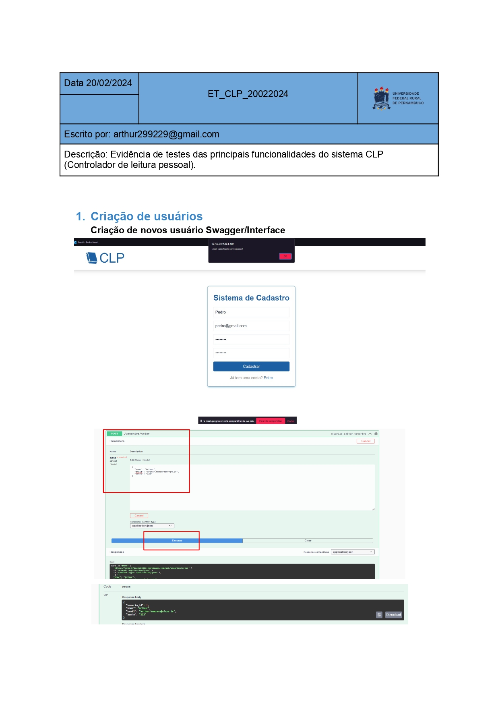
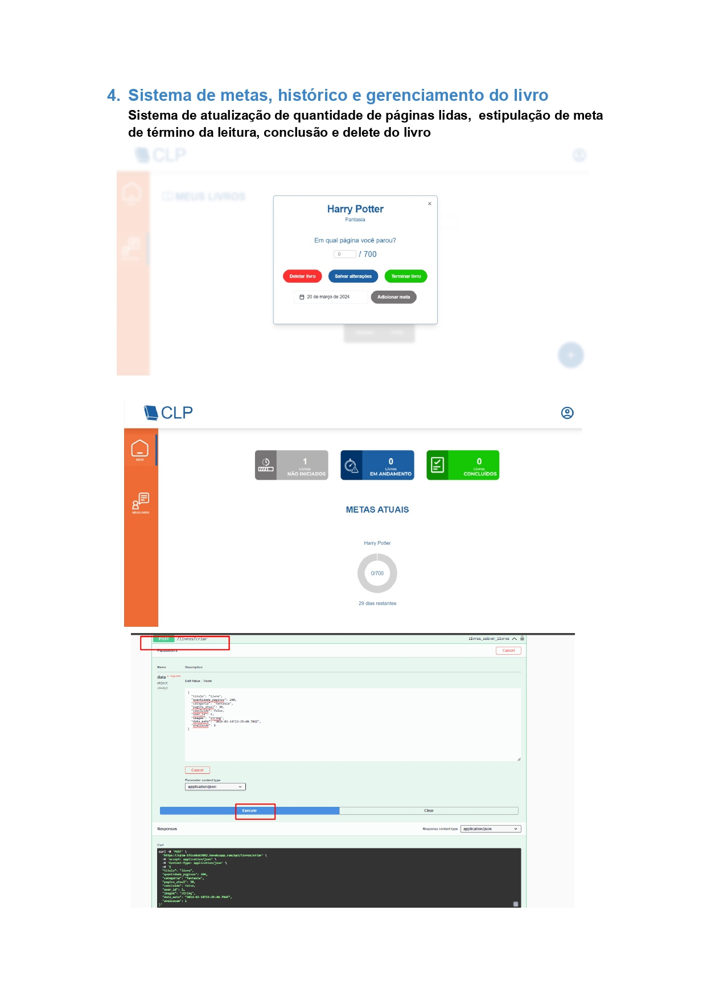
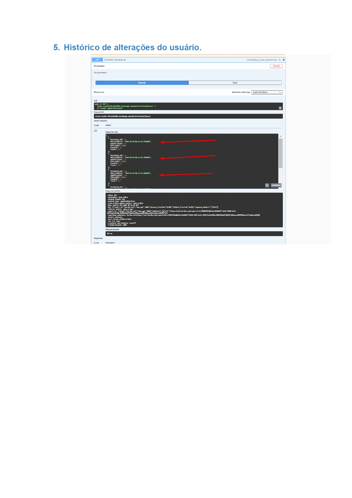
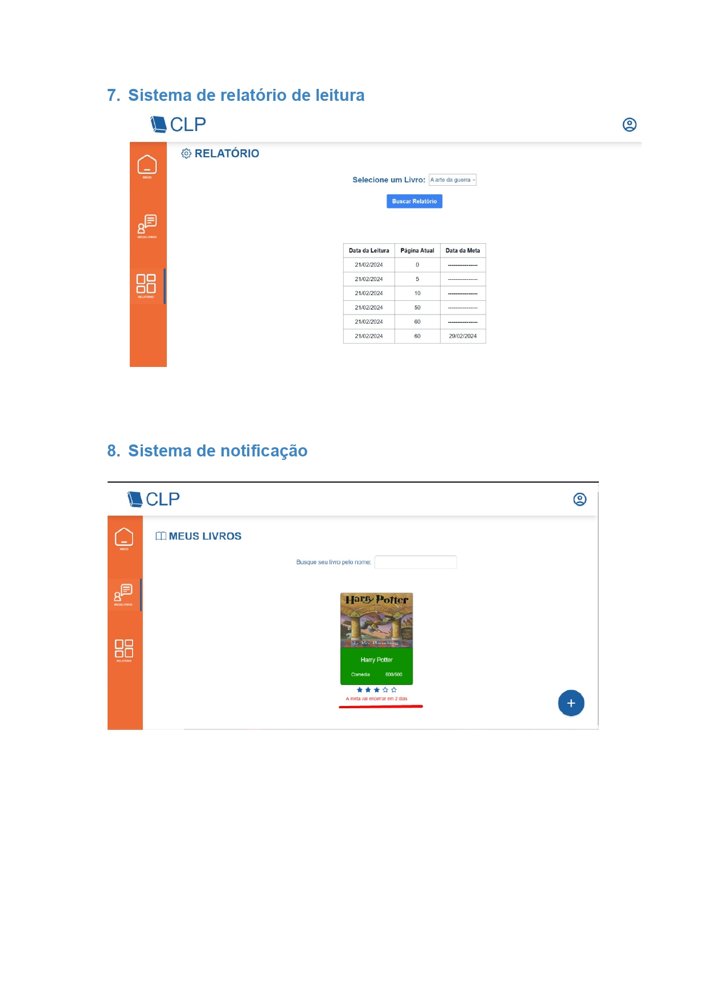

# Controlador de Leitura Pessoal

Página do projeto [CLP-Master](https://github.com/filipeffp/clp-master).

## Equipe

- Arthur Henrique  - nascimentoarthur.br@gmail.com
- Fábio Elvino - fabioelvino@outlook.com
- Filipe Falcão Pimentel - filipeffp@gmail.com
- Henrique Mendes - henrique.barbosa@ufrpe.br
- José Elvis Júlio de Santana - elvislcufrpe@gmail.com
- Maryana Hermínio de Carvalho - maryhdec@gmail.com
- Pedro Henrique - pedrohenrique110401@outlook.com
- Túlio Lorca de Araujo Falcão - falcao.tulio@gmail.com

## Sobre

O projeto CONTROLADOR DE LEITURA PESSOAL é um sistema desenvolvido para proporcionar uma experiência personalizada de controle e organização de leituras. Destinado a entusiastas e apaixonados por livros, o LeitorPessoal oferece uma plataforma intuitiva e funcional para gerenciar a jornada literária de cada usuário. 

## Arquitetura do Projeto

## Diagrama de Classes

## API

###Classe COLEÇÃO:

###Classe HISTÓRICO:

###Classe LIVRO:

###Classe USUÁRIO:

## O APLICATIVO

###Tela Inicial:

###Tela de Cadastro

###Tela de Login:

## CLP: Evidência de Testes das Principais Funcionalidades do Sistema

